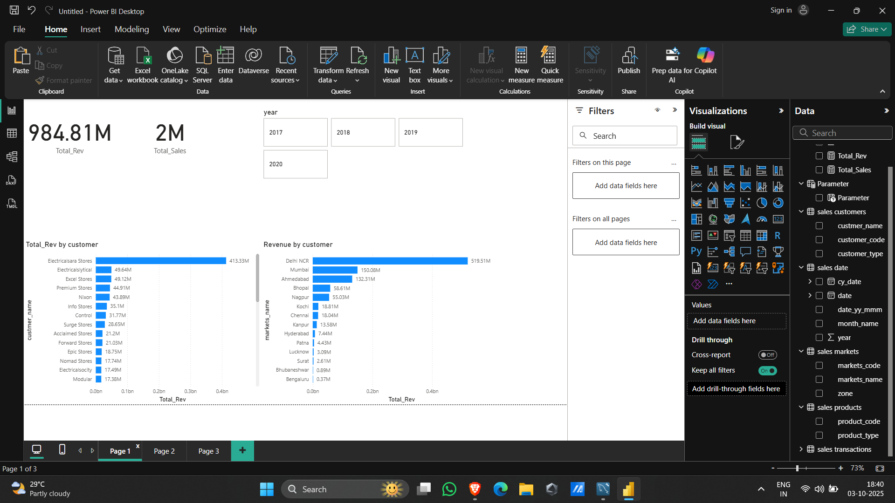
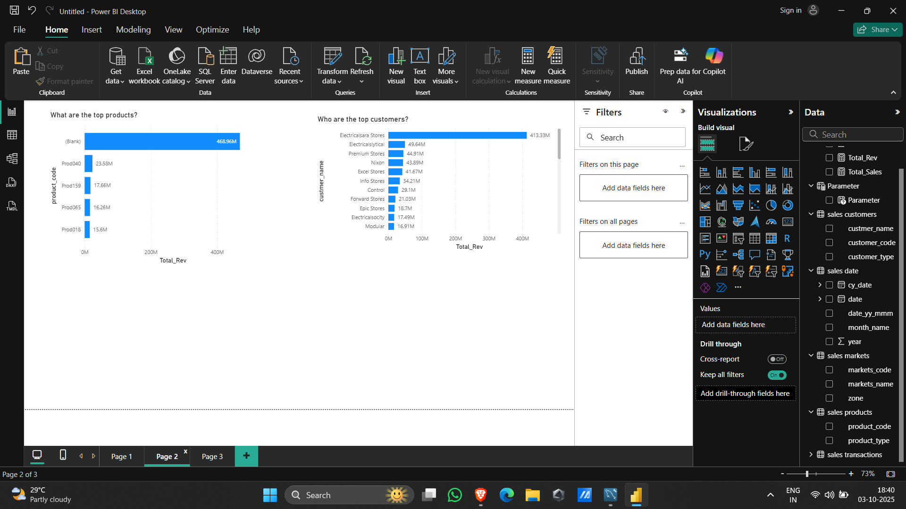
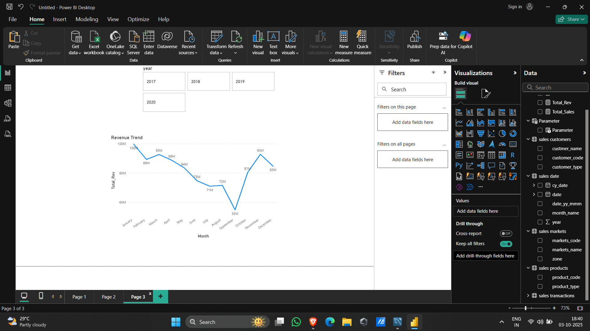

## Project Overview
Interactive Power BI dashboard analyzing revenue across customers, products, and markets.

## Dataset
- Transactions (sales_amount, product, customer, market, date)
- Customers (name)
- Markets (city)
- Date table 

## Key Features
- KPIs: **Total_Rev**, **Total_Sales**
- Revenue by Customer & Market
- Top Products
- Monthly Revenue Trend
- Year parameter (2017–2020)

## Screenshots

### Overview

### Top Products & Customers

### Revenue Trend

## How to Use
1. Download Sale_analysis_project.pbix
2. Open in **Power BI Desktop**

## Tools
Power BI Desktop · DAX ·  SQL

## Author
Sai Aneesh Ganti
gantisaianeesh@gmail.com
